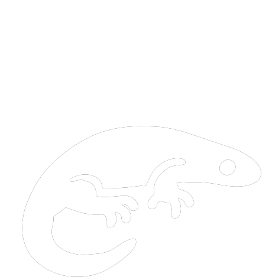

# Elias Telleria (tellxmaster) 👾 💻

  

## **Full-Stack & Software Developer**
Hello, world! I'm Elias Telleria, but you might know me as Tellxmaster in the tech realm. As a full-stack and software developer, I've dedicated myself to harnessing the power of code to create meaningful and effective solutions.

## **📚 Continuous Learning**
In the world of technology, the only constant is change. That's why I'm constantly embracing new challenges and technologies. Currently, I'm immersing myself in the captivating domains of VueJS and GOLang. These cutting-edge technologies are equipping me with the tools to develop more intricate and sophisticated applications.

## **🔧 My Latest Project**
I've recently developed an innovative system designed to streamline the management of video game events. My pride and joy, this project incorporates three integral modules:

User Authentication: Ensure secure and efficient user login.
Event Registration: Incorporates a comprehensive shopping cart system.
Administration Panel: Supervise payments, registrations, and generate insightful reports.
It's a dynamic tool - the Swiss Army knife for event management!

##  **🤝 Collaboration**
I'm an ardent believer in the power of collaboration and am always seeking opportunities to contribute to open-source projects, backend system administration, and anything else that challenges my skills and broadens my knowledge.

## **💡 Vision**
Technology has immense potential to better our lives. My goal? To contribute to projects that aim to better humanity, assist people, or shift paradigms. Together, we can leverage technology for the greater good!

## **📩 Let's Connect**
Whether you're interested in collaborating or just want to chat about tech, I'd love to hear from you. Reach out to me at telleriaelias@gmail.com, text me at +593995794733, or visit my website.

## **🎥 Fun Fact**
Before becoming a programmer, I aspired to be a filmmaker! Although my path has shifted, I still tell stories - now, through code, algorithms, and user experiences.

I invite you to join me on this exciting journey as we explore new frontiers and push the boundaries of what technology can accomplish! 🚀

<!--
**tellxmaster/tellxmaster** is a ✨ _special_ ✨ repository because its `README.md` (this file) appears on your GitHub profile.
-->